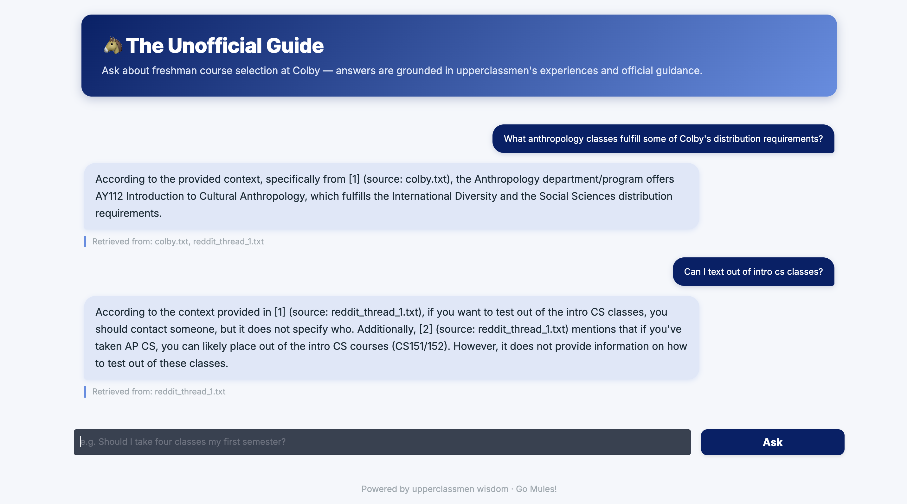

# The Unofficial Guide — Project 1

## Domain

Upperclassmen's experiences with freshmen course selection.

Unlike official sites that state only facts, this knowledge base captures the hustle of students and the strategies they found helpful. That knowledge is scattered across different platforms like Reddit, so this project centralizes it.

---

## Document Sources

| # | Source | Type | URL or file path |
|---|--------|------|-----------------|
| 1 | Quora — What are some of the best courses to take for freshman year? | Q&A forum thread | [Link to source](https://www.quora.com/Colby-College-What-are-some-of-the-best-courses-to-take-for-freshman-year) |
| 2 | Reddit r/Colby — If I have 32 credits heading into my freshman year, does that mean I could graduate a year early? | Forum thread | [Link to source](https://www.reddit.com/r/Colby/comments/15auahz/if_i_have_32_credits_heading_into_my_freshman/) |
| 3 | Reddit r/Colby — Any interesting course recommendation for Math and CS? | Forum thread | [Link to source](https://www.reddit.com/r/Colby/comments/n4v3ml/choosing_courses_for_freshman_year/) |
| 4 | Reddit r/Colby — Tips to Prepare for Freshman Year | Forum thread | [Link to source](https://www.reddit.com/r/Colby/comments/13r76l1/tips_to_prepare_for_freshman_year/) |
| 5 | Reddit r/Colby — Would 5 courses (20 credit) be too much for first semester? | Forum thread | [Link to source](https://www.reddit.com/r/Colby/comments/14cs293/would_5_courses_20_credit_be_too_much_for_first/) |
| 6 | Reddit r/Colby — Understanding Course Requirement | Forum thread | [Link to source](https://www.reddit.com/r/Colby/comments/1df2kua/help_understanding_the_course_taking_requirments/) |
| 7 | Reddit r/Colby — Questions about first-year advising | Forum thread | [Link to source](https://www.reddit.com/r/Colby/comments/1dah8fs/questions_about_firstyear_advising/) |
| 8 | Colby — Diversity and Distribution Areas Requirements | Official page | [Link to source](https://www.colby.edu/academics/first-year-advising/colbys-liberal-arts-curriculum/) |
| 9 | Colby — Advising: what to expect and how to prepare | Official page | [Link to source](https://www.colby.edu/academics/first-year-advising/advising-what-to-expect-and-how-to-prepare/) |
| 10 | Colby — Advice from Departments | Official page | [Link to source](https://www.colby.edu/academics/first-year-advising/advice-from-departments/) |

---

## Chunking Strategy

**Chunk size:**
Paragraph-level chunking — the document text is split on blank lines, so one chunk = one paragraph.
Chunk size is therefore variable rather than a fixed target: chunks average ~64 words (≈ 85 tokens),
with most paragraphs running 3–6 sentences. (A few outliers exist — short list-style lines in
`classes.txt` at one extreme, and one long multi-sentence forum reply at ~320 words at the other.)

**Overlap:**
No overlap.

**Why these choices fit my documents:**
In the documents, each paragraph expresses a complete thought — a single forum reply or a single
requirement paragraph responding to a specific question. Because each paragraph already stands as a
self-contained unit, splitting on paragraph boundaries keeps a complete idea in one chunk, and no
overlap is needed between chunks. Preprocessing is minimal: each paragraph's internal newlines and
extra whitespace are collapsed into a single clean block, and empty paragraphs are dropped.

**Final chunk count:**

227 chunks across the 4 source documents — `classes.txt` (109), `reddit_thread_1.txt` (68),
`colby.txt` (43), and `quora.txt` (7).

**Sample chunks (with source document):**

| # | Source document | Chunk text |
|---|-----------------|------------|
| 1 | `colby.txt` | "Diversity Requirements — Students are required to pass two three- or four-credit-hour courses that have as a central focus overcoming prejudice, privilege, oppression, inequality, and injustice. Thus, typically structures, workings, progress, and consequences of political and cultural changes directed for or against this focus constitute most of the course." |
| 2 | `classes.txt` | "In order to graduate, Colby students must demonstrate proficiency in a foreign language. They can do so through successful completion of a language course designated as 127… Alternatively, students may fulfill this requirement by means of a proficiency exam." |
| 3 | `reddit_thread_1.txt` | "Comments: If you've taken AP CS, you can likely place out of the intro CS courses (CS151/152). That's what I did, and it'll put you slightly ahead. If not, I've heard great things about CS151/152 regardless…" |
| 4 | `reddit_thread_1.txt` | "I would definitely recommend taking four classes, you could still graduate with three, but most people take four, and your advisor will likely suggest u take a fourth… taking only three courses will ease up your workload a lot." |
| 5 | `quora.txt` | "Question: What are some of the best courses to take for freshman year?" |

---

## Embedding Model

**Model used:**
all-MiniLM-L6-v2 via sentence-transformers. Top-k retrieval is set to 3, since the top 3 most relevant chunks result in less noise in generated responses.

**Production tradeoff reflection:**
In production, a more complex model (e.g. OpenAI's `text-embedding-3-large`) would produce more accurate results. However, that would come at a cost and add latency from network calls.

---

## Retrieval Examples

<!-- For each query, the top chunks returned by retrieve() at top-k=3, with their source document
     and cosine distance (lower = more similar). -->

**Example 1 — "If I took AP Computer Science, can I skip the intro CS courses?"**

| Rank | Source | Distance | Chunk (truncated) |
|------|--------|----------|-------------------|
| 1 | `reddit_thread_1.txt` | 0.287 | "If you've taken AP CS, you can likely place out of the intro CS courses (CS151/152). That's what I did, and it'll put you slightly ahead…" |
| 2 | `reddit_thread_1.txt` | 0.412 | "Reason I say especially CS is when u get to major courses, those r a bit competitive… it's always overenrolled…" |
| 3 | `reddit_thread_1.txt` | 0.429 | "Hey, skipping cs151 means being placed right into cs231 or cs166? If the former, who should I contact to test out of the intro cs classes?" |

*Why these chunks are relevant:* The query is about placing out of intro CS via AP credit. Chunk 1 is
a direct, near-verbatim match — it explicitly answers that AP CS lets you place out of CS151/152 — so
it ranks first with the lowest distance. Chunk 3 is the natural follow-up question about which course
you land in (CS231) and who to contact, which is closely related context. Chunk 2 is the weakest of
the three (distance 0.43): it is about CS course competitiveness generally, retrieved because it
shares CS vocabulary, but it does not address placement — illustrating how the third slot can pull in
loosely-related material.

**Example 2 — "Should I take four or five classes my first semester?"**

| Rank | Source | Distance | Chunk (truncated) |
|------|--------|----------|-------------------|
| 1 | `reddit_thread_1.txt` | 0.206 | "I would definitely recommend taking four classes, you could still graduate with three, but most people take four…" |
| 2 | `reddit_thread_1.txt` | 0.243 | "I actually don't know if I recommend taking three classes only in your starting semester. I did four and it was fine…" |
| 3 | `reddit_thread_1.txt` | 0.302 | "That's actually not necessarily true. You'll have to take at least 3 JanPlan courses… you can easily take 3 classes 'for free' one semester." |

*Why these chunks are relevant:* All three are first-year students directly weighing how many classes
to take in the first semester — exactly the decision the query asks about. Chunks 1 and 2 give the
clearest answer (most people take four; four is manageable), which is why they have the two lowest
distances. The retrieval here is strong because the corpus contains a dense cluster of advice on
exactly this question, and all three returned chunks are on-topic.

**Example 3 — "Can I test out of the language requirement?"**

| Rank | Source | Distance | Chunk (truncated) |
|------|--------|----------|-------------------|
| 1 | `reddit_thread_1.txt` | 0.328 | "Dont we have to take a language class as well? You are allowed to test out of language if u have a foreign language ur good at. Many internationals do it…" |
| 2 | `classes.txt` | 0.426 | "In order to graduate, Colby students must demonstrate proficiency in a foreign language… Alternatively, students may fulfill this requirement by means of a proficiency exam." |
| 3 | `classes.txt` | 0.443 | "If you want to study a language you have not studied before, register for the first of the three courses (usually 125)…" |

*Why these chunks are relevant:* This query benefits from retrieval across two different source
documents. Chunk 1 (Reddit) gives the casual student-experience answer ("you are allowed to test
out"), while chunk 2 (the official `classes.txt`) confirms it formally via the proficiency exam — the
two corroborate each other, which is exactly the kind of cross-source grounding the system is meant to
surface.

---

## Grounded Generation

**System prompt grounding instruction:**

The model receives this system message, which constrains it to the retrieved context and forbids
outside knowledge:

> You're the go-to assistant at Colby College when newly admitted students have questions concerning
> course selection. Answer the students' question using only the context provided below. If the answer
> is not in the text, say so clearly — do not guess or draw on outside knowledge. cite the documents
> answers are sourced from

The grounding is reinforced structurally by the user message, which is built in a fixed
`Context:` / `Query:` shape. Each retrieved chunk is inserted under `Context:` and the student's
question under `Query:`, so the model always sees the evidence and the question as separate, clearly
delimited blocks:

```
Context:
[1] (source: reddit_thread_1.txt)
<chunk text>

[2] (source: colby.txt)
<chunk text>

Query:
<student question>
```

Only the top-k=3 chunks are passed, so low-relevance retrieval results never reach the model. In
practice this works: when the answer is genuinely absent from the retrieved chunks (e.g. the easiest-
classes list), the model says the information is not available rather than fabricating one.

**How source attribution is surfaced in the response:**
Each chunk is labelled `[n] (source: <filename>)` in the context, so the model cites the originating
document inline in its answer (e.g. "(source: reddit_thread_1.txt)"). The source travels with each
chunk because `retrieve()` returns a `source` field (stored as ChromaDB metadata at ingest time). The
Gradio interface also renders a separate "Retrieved from" panel listing the de-duplicated source
documents used to ground the response.

**Example responses with source attribution (verbatim system output):**

> **Query:** If I took AP Computer Science, can I skip the intro CS courses?
>
> **Response:** According to the context provided in [1] (source: reddit_thread_1.txt), "If you've
> taken AP CS, you can likely place out of the intro CS courses (CS151/152)". This suggests that yes,
> you can likely skip the intro CS courses if you've taken AP Computer Science.

> **Query:** Can I test out of the language requirement?
>
> **Response:** According to the context provided in [2] (source: classes.txt), "Alternatively,
> students may fulfill this requirement by means of a proficiency exam." This implies that yes, you
> can test out of the language requirement by taking a proficiency exam. Additionally, [1] (source:
> reddit_thread_1.txt) and [3] (source: classes.txt) also support this, with [1] stating "You are
> allowed to test out of language if u have a foreign language ur good at"…

In both cases the source document is named inline in the output text, and the second example shows the
model grounding a single answer in two different sources (`classes.txt` and `reddit_thread_1.txt`).

**Out-of-scope query (refusal):**

> **Query:** What is the best dining hall at Colby and what are its hours?
>
> **Response:** The provided context does not mention the best dining hall at Colby or its hours. The
> context only discusses classes, professors, and essential dorm items, but does not provide
> information about dining halls.

The corpus covers course selection, not dining. Because the system prompt forbids drawing on outside
knowledge and only the top-k=3 retrieved chunks are available, the model declines to answer rather
than fabricating dining-hall information — demonstrating that grounding holds for off-topic queries.

---

## Query Interface



---

## Evaluation Report

<!-- Run your 5 test questions from planning.md through your system and record the results.
     Be honest — a partially accurate or inaccurate result that you explain well is more
     valuable than a suspiciously perfect result. -->

| # | Question | Expected answer | System response (summarized) | Retrieval quality | Response accuracy |
|---|----------|-----------------|------------------------------|-------------------|-------------------|
| 1 | Do I have to take a language class in my freshman year? | Yes, all freshmen are required to take three semesters of a language. Students that speak a foreign language can test out. | Said you don't strictly have to take it in freshman year — correctly noted the 3-semester requirement just needs completing before graduation (reddit_thread_1.txt) and pointed to the placement/proficiency process (classes.txt), but framed the timing as "not required in freshman year." | Relevant | Partially accurate |
| 2 | Which distribution requirements must be completed in my freshman year | First-year students are required to take a writing-intensive course (W1) and should begin work on their foreign language requirement. | Said no distribution requirements must be completed in freshman year. Cited colby.txt (lists the area requirements but gives no timeline) and a reddit chunk where a student notes finishing all distribution requirements except language and US diversity by end of freshman year. Still missed the W1 / foreign-language first-year requirement. | Partially relevant | Inaccurate |
| 3 | What are the easiest classes at Colby? | Logic 1, CS152, MA130, EC133, SP125, MA274 | Said the easiest classes are not stated in the context — it retrieved the matching *question* ("What are the easiest classes you've taken at Colby?") but not the *answer* paragraph listing the courses. | Partially relevant | Inaccurate |
| 4 | If I took AP Computer Science, can I skip the intro CS courses? | Yes — with a high enough AP CS score you can place out of CS151/152 and go straight to CS231. No certificate needed; email the CS chair and complete a quick placement test. | Correctly answered yes, you can likely place out of CS151/152 with AP CS, citing reddit_thread_1.txt. Did not surface the CS231 / email-the-chair / placement-test details. | Relevant | Accurate |
| 5 | Why do students recommend signing up for 5 classes and then dropping to 4? | Because Colby has a really long drop period, so students register for 5 classes and drop down to 4 if the workload feels too heavy. | Directly answered: students sign up for 5 and drop to 4 because the school's long drop period lets you drop a class if the workload feels too heavy, and to avoid regretting not taking a course early. Correctly named the long drop period as the reason. | Relevant | Accurate |

**Retrieval quality:** Relevant / Partially relevant / Off-target  
**Response accuracy:** Accurate / Partially accurate / Inaccurate

---

## Failure Case Analysis

<!-- Identify at least one question where retrieval or generation did not work as expected.
     Write a specific explanation of *why* it failed, tied to a part of the pipeline.

     "The answer was wrong" is not an explanation.

     "The relevant information was split across a chunk boundary, so retrieval returned
     only half the context — the model didn't have enough to answer correctly" is an explanation.

     "The embedding model treated the professor's nickname as out-of-vocabulary and returned
     results from an unrelated review" is an explanation. -->

**Question that failed:**
"What are the easiest classes at Colby?" (test question 3). Expected answer: Logic 1, CS152, MA130,
EC133, SP125, MA274.

**What the system returned:**
The system said the easiest classes are not stated in the provided context. Its top retrieval was a
near-perfect match (cosine distance 0.039) — but the chunk it matched was the *question*
"What are the easiest classes you've taken at Colby?", not the reply that actually lists the courses.
With no answer text in the context, the model correctly refused to guess and reported the
information as unavailable.

**Root cause (tied to a specific pipeline stage):**
Chunking (Stage 2). The corpus stores a forum question and its answer as two separate paragraphs, and
the paragraph-based, zero-overlap strategy splits them into two independent chunks. The question
paragraph ("What are the easiest classes...") embeds almost identically to the user's query, so it
dominates retrieval, while the answer paragraph (the list of courses) embeds differently and never
enters the top-k=3. Retrieval then returns the half of the conversation that restates the question
and omits the half that answers it — so generation had no grounding to work from. The grounding
itself behaved correctly; the failure is upstream, in how the document was divided.

**What you would change to fix it:**
Make a chunk carry both the question and its answer instead of splitting them. Options, roughly in
order of effort: (1) preprocess the Reddit/Quora dumps so each question is merged with the reply
paragraph(s) beneath it into a single chunk; (2) add a small inter-paragraph overlap so a chunk
includes the start of the following paragraph; or (3) retrieve a larger top-k and include the
neighboring chunk (by `chunk_id` index) of each hit, so an answer paragraph is pulled in alongside
its matched question. Option (1) targets this failure most directly given the clear question/answer
structure of these sources.

---

## Spec Reflection

<!-- Reflect on how planning.md shaped your implementation.
     Answer both questions with at least 2–3 sentences each. -->

**One way the spec helped you during implementation:**
It made my prompt conscise and well crafted. I just reference sections of my planning.md in my prompts and that is it! 

**One way your implementation diverged from the spec, and why:**
My implementation never diverged from the spec. I attribute this to the modular approach that I used in my prompting. I asked claude to do small, specific tasks one at a time

---

## AI Usage

**Instance 1**

- *What I gave the AI:* my Chunking Strategy section and documents folder and asked it to implement chunk_text() and load_documents() in an ingest.py
- *What it produced:* It returned the ingest.py containing the two functions as instructed
- *What I changed or overrode:* I deleted the main function it had included for testing purposes

**Instance 2**

- *What I gave the AI:* The Gradio template for the UI and asked it to implement a similar interface for the system
- *What it produced:* It produced a minimalist UI
- *What I changed or overrode:* I instructed it to add colors and make the UI chat-like
